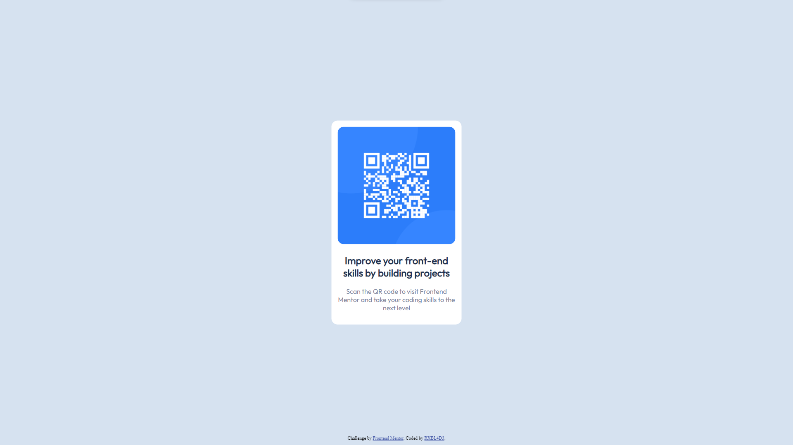

# Frontend Mentor - QR code component solution

This is a solution to the [QR code component challenge on Frontend Mentor](https://www.frontendmentor.io/challenges/qr-code-component-iux_sIO_H). Frontend Mentor challenges help you improve your coding skills by building realistic projects.

## Table of contents

- [Overview](#overview)
  - [Screenshot](#screenshot)
  - [Built with](#built-with)
  - [What I learned](#what-i-learned)
  - [Continued development](#continued-development)
  - [Useful resources](#useful-resources)
- [Author](#author)

## Overview

This is my first experience with Frontend Mentor.

### Screenshot

### Built with

- Semantic HTML5 markup
- CSS custom properties
- Mobile-first workflow
- Blood and tears

### What I learned

I learned how to style elements and the most annoying part of CSS CENTERING THINGS.

### Continued development

Next up I will study Tailwind CSS and a little bit of SASS for the design part and I'm planning on using React or Next.js from now on.

### Useful resources

[StackOverflow](https://stackoverflow.com/questions/14676613/how-to-import-google-web-font-in-css-file) - yes, I forgot how to link a font.
[css-tricks](https://css-tricks.com/responsive-styling-using-attribute-selectors/) I have never used media queries until now.

## Author

- Frontend Mentor - [@RXBlade](https://www.frontendmentor.io/profile/RXBlade)
